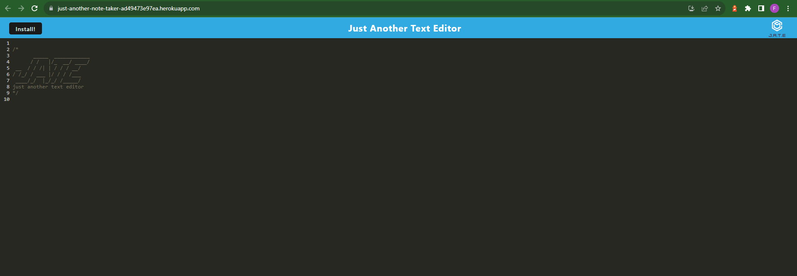

# PWA-Text-Editor

## User Story

```md
AS A developer
I WANT to create notes or code snippets with or without an internet connection
SO THAT I can reliably retrieve them for later use
```

## Acceptance Criteria

```md
GIVEN a text editor web application
WHEN I open my application in my editor
THEN I should see a client server folder structure
WHEN I run `npm run start` from the root directory
THEN I find that my application should start up the backend and serve the client
WHEN I run the text editor application from my terminal
THEN I find that my JavaScript files have been bundled using webpack
WHEN I run my webpack plugins
THEN I find that I have a generated HTML file, service worker, and a manifest file
WHEN I use next-gen JavaScript in my application
THEN I find that the text editor still functions in the browser without errors
WHEN I open the text editor
THEN I find that IndexedDB has immediately created a database storage
WHEN I enter content and subsequently click off of the DOM window
THEN I find that the content in the text editor has been saved with IndexedDB
WHEN I reopen the text editor after closing it
THEN I find that the content in the text editor has been retrieved from our IndexedDB
WHEN I click on the Install button
THEN I download my web application as an icon on my desktop
WHEN I load my web application
THEN I should have a registered service worker using workbox
WHEN I register a service worker
THEN I should have my static assets pre cached upon loading along with subsequent pages and static assets
WHEN I deploy to Heroku
THEN I should have proper build scripts for a webpack application
```

## Description

A simple note taker single page application that can be run in the browser and offline.

## Screenshot of deployed application



## Link to deployed application

https://just-another-note-taker-ad49473e97ea.herokuapp.com/

## License

[](https://opensource.org/licenses/MIT) [Open Source Initiative Link](https://opensource.org/licenses/MIT)

## Contributing

Contributions to this project will not be accepted at this time, as this project is an assessment piece for a coding course, and it must be the project author's own work. However, feel free to fork the repository and make your own changes!

## Author

Click the links below to reach out to the developer for this project.

Fergus Illman

Email: <a href="mailto:fergus.coding@gmail.com">fergus.coding@gmail.com</a>

[Link to my Github](https://github.com/Fergus-Codes)
